# 🤖 AI Chatbot for Business Websites

<div align="center">


</div>

<p align="center">
  <strong>An intelligent, document-aware chatbot solution built with modern AI technologies.</strong>
  <br>
  This application enables businesses to create custom chatbots that can understand and respond to queries based on uploaded documents, policies, and knowledge bases.
</p>

<div align="center">

[Features](#-features) • [Tech Stack](#-tech-stack) • [Installation](#-installation) • [Usage](#-usage) • [API Docs](#-api-documentation)

</div>

## 📋 Table of Contents

- [Features](#-features)
- [Tech Stack](#-tech-stack)
- [Architecture](#-architecture)
- [Prerequisites](#-prerequisites)
- [Installation](#-installation)
- [Configuration](#-configuration)
- [Usage](#-usage)
- [API Documentation](#-api-documentation)
- [Project Structure](#-project-structure)
- [Contributing](#-contributing)
- [License](#-license)

## ✨ Features

<table>
<tr>
<td width="50%">

### 🎯 Core Features
- 💬 **Intelligent Chat Interface**
  - Real-time conversational AI
  - Powered by LangChain
- 📄 **Multi-Format Document Processing**
  - PDF, DOCX, XLSX, TXT support
  - Automatic text extraction
- 🔍 **Semantic Search**
  - Vector-based retrieval
  - ChromaDB integration
- 🎯 **Context-Aware Responses**
  - Document-based answers
  - Business-specific knowledge

</td>
<td width="50%">

### 🚀 Technical Features
- 🛡️ **Admin Dashboard**
  - Document management
  - Knowledge base control
- ⚡ **High Performance**
  - FastAPI backend
  - Next.js frontend
- 🎨 **Modern UI/UX**
  - Responsive design
  - TypeScript type safety
- 🔄 **Real-time Updates**
  - Instant indexing
  - Live chat responses

</td>
</tr>
</table>

## 🛠 Tech Stack

### 🔧 Backend Stack

<div align="center">


</div>

| Technology | Version | Purpose |
|------------|---------|---------|
| **Python** | 3.10+ | Core backend language |
| **FastAPI** | 0.109.0 | High-performance web framework |
| **LangChain** | 0.1.0+ | AI orchestration and chain management |
| **ChromaDB** | 0.4.0+ | Vector database for embeddings |
| **Sentence Transformers** | 2.3.0+ | Text embeddings generation |
| **Hugging Face** | Latest | AI model integration |
| **PyTorch** | 2.2.0+ | Deep learning framework |
| **Pydantic** | 2.5.3 | Data validation and settings |
| **Uvicorn** | 0.27.0 | ASGI server |

### 🎨 Frontend Stack

<div align="center">


</div>

| Technology | Version | Purpose |
|------------|---------|---------|
| **Next.js** | 14.0.4 | React framework with SSR |
| **React** | 18.2.0 | UI library |
| **TypeScript** | 5.3.3 | Type-safe JavaScript |
| **Axios** | 1.6.2 | HTTP client |
| **React Markdown** | 9.0.1 | Markdown rendering |

### 📚 Document Processing

<div align="center">


</div>

- 📕 **PyPDF** - PDF document parsing
- 📘 **python-docx** - Word document processing  
- 📗 **openpyxl** - Excel file handling
- 📊 **pandas** - Data manipulation and analysis

## 🏗 Architecture

```mermaid
graph TD
    A[🎨 Next.js Frontend<br/>React + TypeScript] -->|HTTP/REST API| B[⚡ FastAPI Backend<br/>Python]
    B -->|AI Chain| C[🦜 LangChain<br/>AI Orchestration]
    B -->|Vector Storage| D[🗄️ ChromaDB<br/>Vector Database]
    B -->|Document Processing| E[📄 Document Processor<br/>PDF/DOCX/XLSX/TXT]
    C -->|Embeddings| F[🤗 Hugging Face<br/>Sentence Transformers]
    E -->|Index| D
    
    style A fill:#61DAFB,stroke:#333,stroke-width:2px,color:#000
    style B fill:#009688,stroke:#333,stroke-width:2px
    style C fill:#1C3C3C,stroke:#333,stroke-width:2px
    style D fill:#FF6F00,stroke:#333,stroke-width:2px
    style E fill:#4CAF50,stroke:#333,stroke-width:2px
    style F fill:#FFD21E,stroke:#333,stroke-width:2px,color:#000
```

<div align="center">



</div>

## 📦 Prerequisites

<div align="center">

| Requirement | Version | Download |
|------------|---------|----------|
|  | v18.0+ | [Download](https://nodejs.org/) |
|  | v3.10+ | [Download](https://www.python.org/) |
|  | Latest | Included with Node.js |
|  | Latest | [Download](https://git-scm.com/) |

</div>

## 🚀 Installation

<div align="center">

### 📥 Quick Start Guide

</div>

### 1️⃣ Clone the Repository

```bash
git clone https://github.com/yourusername/ai-chatbot-for-business.git
cd ai-chatbot-for-business
```

### 2️⃣ Backend Setup

```bash
cd backend

# Create virtual environment
python -m venv venv

# Activate virtual environment
# Windows:
venv\Scripts\activate
# Linux/Mac:
source venv/bin/activate

# Install dependencies
pip install -r requirements.txt
```

### 3️⃣ Frontend Setup

```bash
cd frontend

# Install dependencies
npm install
# or
yarn install
```

## ⚙️ Configuration

### Backend Configuration

Create a `.env` file in the `backend` directory:

```env
# API Configuration
API_HOST=0.0.0.0
API_PORT=8000

# CORS Settings
CORS_ORIGINS=["http://localhost:3000"]

# Hugging Face API (if using cloud models)
HUGGINGFACE_API_KEY=your_api_key_here

# ChromaDB Settings
CHROMA_DB_PATH=./chroma_db

# Upload Settings
UPLOAD_DIR=./uploads
MAX_UPLOAD_SIZE=10485760  # 10MB
```

### Frontend Configuration

Create a `.env.local` file in the `frontend` directory:

```env
NEXT_PUBLIC_API_URL=http://localhost:8000
```

## 🎯 Usage

### 🔴 Starting the Backend

```bash
cd backend
uvicorn main:app --reload --host 0.0.0.0 --port 8000
```

The API will be available at: `http://localhost:8000`
API Documentation (Swagger): `http://localhost:8000/docs`

### 🟢 Starting the Frontend

```bash
cd frontend
npm run dev
# or
yarn dev
```

The application will be available at: `http://localhost:3000`

### 💡 Using the Application

<table>
<tr>
<td align="center" width="33%">

### 1️⃣ Upload
📤

Navigate to Admin Panel and upload business documents

`PDF • DOCX • TXT • XLSX`

</td>
<td align="center" width="33%">

### 2️⃣ Chat
💬

Go to Chat interface and ask questions about documents

`Natural Language`

</td>
<td align="center" width="33%">

### 3️⃣ Get Answers
🤖

Receive AI-powered responses based on your content

`Context-Aware`

</td>
</tr>
</table>

## 📚 API Documentation

### Chat Endpoints

- `POST /api/chat` - Send a message and get AI response
  ```json
  {
    "message": "What is your refund policy?"
  }
  ```

### Document Endpoints

- `POST /api/documents/upload` - Upload a document
- `GET /api/documents` - List all documents
- `DELETE /api/documents/{id}` - Delete a document

### Admin Endpoints

- `GET /api/admin/stats` - Get system statistics
- `POST /api/admin/reindex` - Reindex all documents

For complete API documentation, visit `/docs` when the backend is running.

## 📁 Project Structure

```
AIChat/
├── backend/
│   ├── config.py              # Configuration management
│   ├── main.py                # FastAPI application entry
│   ├── schemas.py             # Pydantic models
│   ├── requirements.txt       # Python dependencies
│   ├── routes/
│   │   ├── chat_routes.py     # Chat endpoints
│   │   ├── document_routes.py # Document management
│   │   └── admin_routes.py    # Admin endpoints
│   ├── services/
│   │   ├── chatbot.py         # AI chatbot logic
│   │   ├── document_processor.py  # Document parsing
│   │   └── vector_store.py    # ChromaDB operations
│   ├── chroma_db/             # Vector database storage
│   └── uploads/               # Uploaded documents
├── frontend/
│   ├── app/
│   │   ├── page.tsx           # Main page
│   │   ├── layout.tsx         # App layout
│   │   └── globals.css        # Global styles
│   ├── components/
│   │   ├── Chat.tsx           # Chat interface
│   │   └── AdminPanel.tsx     # Admin dashboard
│   ├── utils/
│   │   └── api.ts             # API client
│   ├── package.json           # Node dependencies
│   └── tsconfig.json          # TypeScript config
└── README.md                  # This file
```

## 🔧 Development

### Running Tests

```bash
# Backend tests
cd backend
python -m pytest

# Frontend tests
cd frontend
npm test
```

### Code Quality

```bash
# Backend linting
cd backend
pylint **/*.py

# Frontend linting
cd frontend
npm run lint
```

## 👥 Authors

- Your Name - Nipuni Perera

## 🙏 Acknowledgments

- LangChain for AI orchestration
- ChromaDB for vector storage
- Hugging Face for open-source models
- FastAPI and Next.js communities

